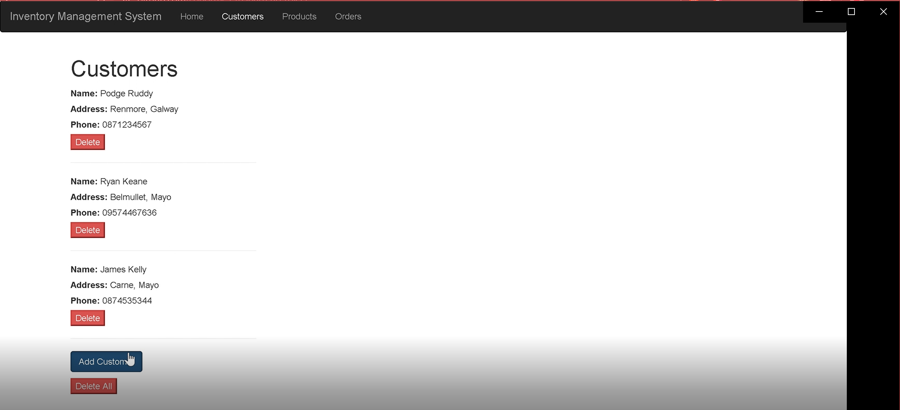
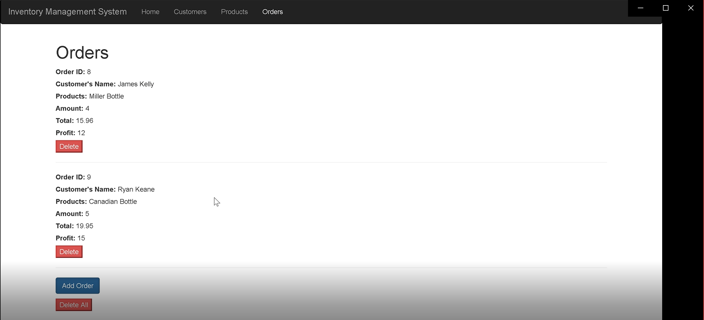
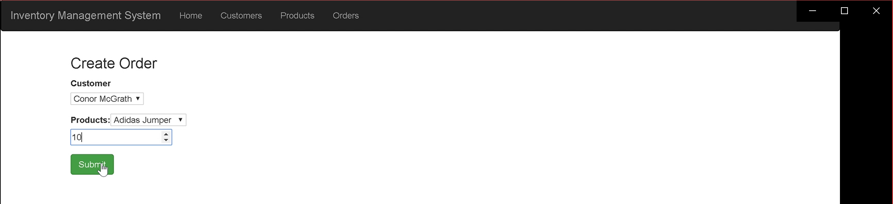

## Final Year Project - Inventory Managment System

---
###### _Written by Aaron Healy & Conor McGrath_
---  


#### Table of Contents
1. [Project Details](#details)
2. [Introduction](#intro)
3. [Video Demo](#demo)
4. [Dissertation](#dissertation)
5. [Architecture](#arc) 
6. [Features](#features)
7. [App Preview](#preview)
8. [Deployment](#deploy)

---

#### Project Details<a name = "details"></a>

|    |     |
| --- | --- |
| **Course** | BSc (Hons) in Software Development  |
| **Module** |  Applied Project and Minor Dissertation |
| **College** | [GMIT](http://www.gmit.ie/) Galway |
| **Students** | [Aaron Healy] G00333148 <br/> [Conor McGrath] G00291461 |
| **Project Supervisor** | Daniel Cregg |
| **Module Supervisor** | Dr. John Healy |
| **Project Title** | Inventory Managament System |


#### Introduction<a name = "intro"></a>
For our final year project, we wanted to look at Inventory Management Systems and how they work. We then wanted to create our own Inventory Management System Application. We chose this topic as Inventory Management Systems are important for every business. They let the business manage all their stock and orders and allows them to monitor how they're company is operating. We developed an application that allows users to keep track of their customers, products and orders. We focused on these items as we felt they are the three main components that make up an Inventory Mangement System. We created a 3-tier application, using a MySQL database, a Java Spring Boot backend and an Angular application as our frontend. 


#### Video Demo<a name = "demo"></a>


#### Dissertation<a name = "dissertation"></a>
Click below to view our Dissertation.

<kbd>[</img>]()</kbd>


# Architecture<a name = "arc"></a>
The following is an overview of the Architecture of our application.

<p align="center"><kbd></p></kbd>

### Frontend

* [Angular 6 Framework](https://angular.io/)

### Backend
* [Java](https://www.java.com/)
* [Spring Framework](https://spring.io/)

### Database
* [MySQL](https://www.mysql.com/) 


# Features<a name = "features"></a>
The following are the main features of our project:
* Users can Sign Up for their own Account.
* Users can then Login to their Account.
* Users can view all their current customers.
* Users can create a new customer.
* Users can view all their current products.
* Users can create a new product.
* Users can view all their current orders.
* Users can create a new order.
* Users can view their five most recent orders.
* Users can view their top customers.


# App Preview<a name = "preview"></a>
The following images are previews of various pages in our application. 

---

##### Login Page
This is the landing page for our application and lets the user login using JWT authentication and Spring Security.
|  |

---
##### Sign Up Page
This is the sign up page for our application and lets the user register using the same method for authentication as above.
|  |

---
##### Customers Page
Here we can view the list of custmers for the current user.
|  |
 
---
##### Create Customer
This page lets the user input form data for another customer.
|  |

---
##### Products Page
This page lets the current user view prodcuts that they currently offer.
|  |

---
##### Create Product
This page allows the user to add to the existing list of products.
|  |

---
##### Orders Page
This page lets the current user view orders that they have already placed for their customers..
|  |

---
##### Create Order
This page allows the user to create an order based off the prodcuts made available by the user.
|  |

# Deployment<a name = "deploy"></a>

## Deploy Locally
1. Clone or Download this repository.
2. Open the project in a Java IDE and run as a Java Application.
3. In your terminal or CMD, navigate to the frontend folder. Complete the following commands to get the correct node modules needed.
```
npm install
```
After this is complete, run the frontened by using.
```
ng serve
```
The application should now be running in your browser at localhost:4200.

[Top](#contents) 
